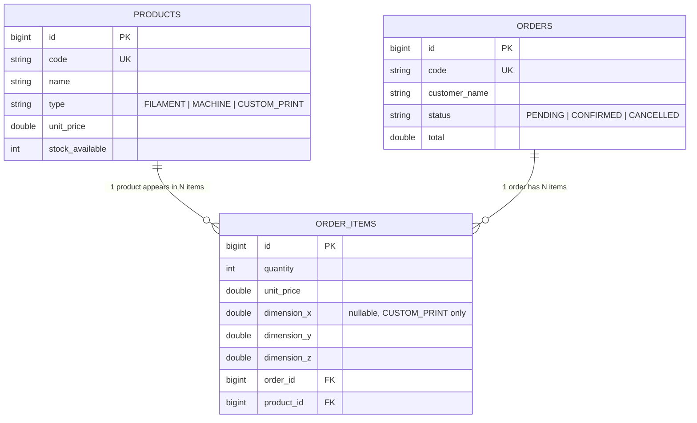

# NebulaStore API (`nebulastore-api`)


-blue.svg)


**NebulaStore API** is a RESTful microservice built with **Java 21** and **Spring Boot 4.1.1** for a 3D printing store: a product catalog (filaments, machines, and custom prints) and order management with stock and print-volume validation. It persists data in **PostgreSQL 16** containerized with Docker Compose, documents its contracts with **OpenAPI/Swagger** (profile-isolated), handles errors centrally, and includes unit tests with Mockito plus coverage reporting with JaCoCo.

This project builds on a pure domain previously developed with TDD and Clean Architecture ([NEBULASTORE](https://github.com/Thoorcito/NEBULASTORE)), evolved in this Hito 4 into a production-ready, persistent microservice.

---

## Architecture and project structure

```text
nebulastore-api/
├── pom.xml
├── README.md
├── compose.yml
├── .env.example
├── .gitignore
└── src/
    ├── main/
    │   ├── java/cl/thoorcito/nebulastore/
    │   │   ├── NebulastoreApplication.java
    │   │   ├── ServletInitializer.java
    │   │   │
    │   │   ├── domain/                        # Domain layer (no Spring dependencies)
    │   │   │   ├── model/                     # Product, Order, OrderItem (records)
    │   │   │   └── exception/                 # Business exceptions
    │   │   │
    │   │   ├── application/                   # Use cases
    │   │   │   └── service/                   # ProductService/Impl, OrderService/Impl
    │   │   │
    │   │   └── infrastructure/                # Technical details
    │   │       ├── persistence/               # JPA entities + Spring Data repositories
    │   │       └── web/                       # Controllers, DTOs, config, exception handler
    │   │
    │   └── resources/
    │       ├── application.yaml               # Global config + active profile
    │       ├── application-dev.yaml           # Development profile (Swagger enabled)
    │       └── application-prod.yaml          # Production profile (Swagger disabled)
    │
    └── test/java/cl/thoorcito/nebulastore/
        └── application/service/               # Unit tests with Mockito
```

**Dependency rule:** `domain` depends on nothing external; `application` orchestrates the domain by injecting the JPA repositories from infrastructure directly; `infrastructure` is the only layer aware of Spring, JPA, and Postgres.

## Relational model



---

## Environment variables and Docker

Copy `.env.example` to create your local `.env`:

```bash
cp .env.example .env
```

| Variable | Description | Local value |
| :--- | :--- | :--- |
| `SERVER_PORT` | Port where Spring Boot listens | `8080` |
| `DB_HOST` | PostgreSQL host | `localhost` |
| `DB_PORT` | PostgreSQL port | `5432` |
| `DB_NAME` | Database name | `nebulastore_db` |
| `DB_USER` | PostgreSQL user | `nebulastore_user` |
| `DB_PASSWORD` | PostgreSQL password | (set in your `.env`) |

### Starting PostgreSQL with Docker

```bash
docker compose up -d
docker compose down
```

---

## Running the application

```bash
./mvnw spring-boot:run
```

The app starts at `http://localhost:8080` with the `dev` profile active by default.

- **Swagger-UI**: `http://localhost:8080/swagger-ui.html`
- **OpenAPI JSON**: `http://localhost:8080/api-docs`

Under the `prod` profile, Swagger is fully disabled (`springdoc.swagger-ui.enabled: false`), preventing the API documentation from being exposed outside the development environment.

---

## Tests and coverage (JaCoCo)

```bash
./mvnw clean test
```

Generates the HTML report at:
```text
target/site/jacoco/index.html
```

Unit tests cover the `application.service` layer with Mockito (mocking the JPA repositories), validating business rules: insufficient stock, invalid quantities, print dimensions out of range, and resources not found.

---

## REST API documentation

### 1. Products (`/api/v1/products`)

| Method | Endpoint | Description | Status Code |
| :--- | :--- | :--- | :--- |
| `GET` | `/api/v1/products` | List all products | `200 OK` |
| `GET` | `/api/v1/products/{id}` | Get a product by ID | `200 OK` / `404 Not Found` |
| `POST` | `/api/v1/products` | Create a new product | `201 Created` / `400 Bad Request` |
| `PUT` | `/api/v1/products/{id}` | Update an existing product | `200 OK` / `400 Bad Request` / `404 Not Found` |
| `DELETE` | `/api/v1/products/{id}` | Delete a product | `204 No Content` / `404 Not Found` |

**Create payload:**
```json
{
  "code": "FIL-PLA-001",
  "name": "PLA Filament 1kg",
  "type": "FILAMENT",
  "unitPrice": 15000,
  "stockAvailable": 20
}
```

### 2. Orders (`/api/v1/orders`)

| Method | Endpoint | Description | Status Code |
| :--- | :--- | :--- | :--- |
| `GET` | `/api/v1/orders` | List all orders | `200 OK` |
| `GET` | `/api/v1/orders/{id}` | Get an order with its items | `200 OK` / `404 Not Found` |
| `POST` | `/api/v1/orders` | Create an order, validating stock and dimensions | `201 Created` / `400 Bad Request` / `404 Not Found` / `422 Unprocessable Entity` |
| `GET` | `/api/v1/orders/{id}/items` | List the items of an order | `200 OK` / `404 Not Found` |

**Create payload (catalog product):**
```json
{
  "customerName": "Felipe",
  "items": [
    { "productId": 1, "quantity": 2 }
  ]
}
```

**Create payload (CUSTOM_PRINT product, requires dimensions):**
```json
{
  "customerName": "Felipe",
  "items": [
    { "productId": 3, "quantity": 1, "dimensionX": 100, "dimensionY": 100, "dimensionZ": 50 }
  ]
}
```

### 3. Error handling

| Scenario | HTTP Status | Domain exception |
| :--- | :--- | :--- |
| Product or order not found | `404 Not Found` | `ResourceNotFoundException` |
| Insufficient stock | `422 Unprocessable Entity` | `OutOfStockException` |
| Invalid quantity (≤ 0) | `400 Bad Request` | `InvalidQuantityException` |
| Piece exceeds the print volume (220x220x250mm) | `400 Bad Request` | `ExceedsBuildVolumeException` |
| DTO validation (`@Valid`) | `400 Bad Request` | `MethodArgumentNotValidException` |
| Malformed JSON or number out of range | `400 Bad Request` | `HttpMessageNotReadableException` |

All errors return the same uniform format:
```json
{
  "code": 422,
  "message": "Insufficient stock for FIL-PLA-001: available 5, requested 10",
  "timestamp": "2026-08-28T10:30:00"
}
```

---

## Quick testing with cURL

```bash
# 1. Create a product
curl -i -X POST http://localhost:8080/api/v1/products \
  -H "Content-Type: application/json" \
  -d '{"code": "FIL-PLA-001", "name": "PLA Filament 1kg", "type": "FILAMENT", "unitPrice": 15000, "stockAvailable": 20}'

# 2. List products
curl -i -X GET http://localhost:8080/api/v1/products

# 3. Create an order
curl -i -X POST http://localhost:8080/api/v1/orders \
  -H "Content-Type: application/json" \
  -d '{"customerName": "Felipe", "items": [{"productId": 1, "quantity": 2}]}'

# 4. View the created order
curl -i -X GET http://localhost:8080/api/v1/orders/1
```

---

## Possible improvements

- **Test data seeding**: add a `data.sql` file in `src/main/resources/` or a `CommandLineRunner` to preload sample products when starting the development environment, avoiding the need to create them manually every time.

## Tech stack

- Java 21, Spring Boot 4.1.1
- Spring Data JPA + PostgreSQL 16
- Springdoc OpenAPI 3.1.0 (Swagger-UI)
- JUnit 5 + Mockito
- JaCoCo
- Docker Compose